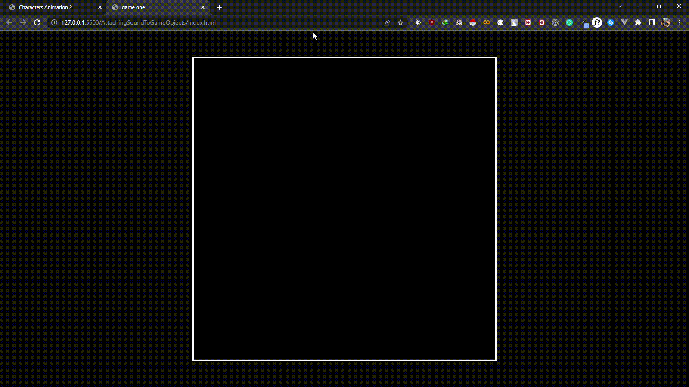

# Attach sounds to game objects

### intro

This is a simple illustration of how to attach sound to game objects

### demo

<!-- images go here -->

### What it covers

- basic js css and html
- sprite animation
- object orient js
- js sound manipulation

### conclusion

It was fun to learn this hope you did learn something ☺
