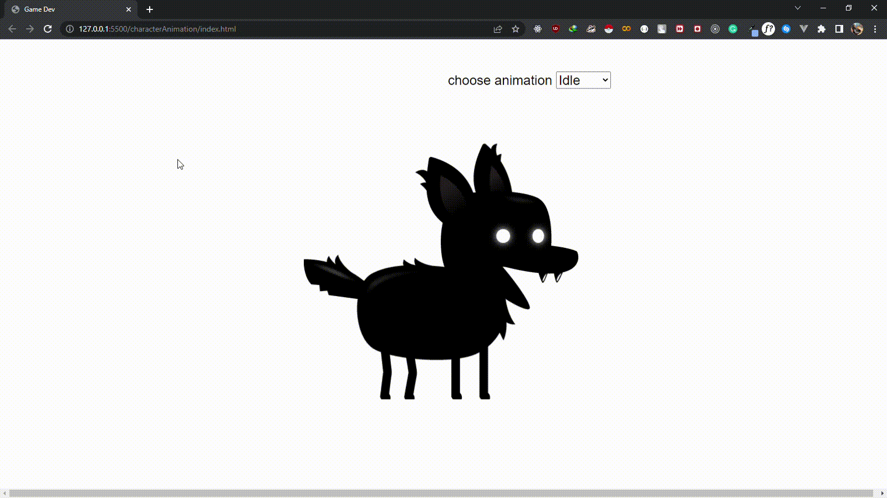

# Character animation

### intro

This illustration how one can achieve various animation using just js, css and html for a player base character or any others which might have various animation effects

look at this code and try to understand or use chatGPT LOL :>)

**this code push the x & y postion as objects to loc**

```
animationState.forEach((state, index) => {
  let frames = {
    loc: [],
  }
  for (let j = 0; j < state.frames; j++) {
    let positionX = j * spriteWidth
    let positionY = index * spriteHeight
    frames.loc.push({ x: positionX, y: positionY })
  }
  spriteAnimations[state.name] = frames
})
```

**this code draws animation for each state of the object depending with `playerState`**

```
let position =Math.floor(gameFrame / staggerFrames) % spriteAnimations[playerState].loc.length //get postion
  frameX = spriteWidth * position
  frameY = spriteAnimations[playerState].loc[position].y
  ctx.drawImage(
    playerImage, //player image object
    frameX, // sx position x in the image where we are currently at
    frameY, // sy position y in the image where we are currently at
    spriteWidth, // sw source width
    spriteHeight,// sh source height
    0, //x position in the canvas where the image is placed
    0, //y position in the canvas where the image is placed
    spriteWidth, // width size of where in the canvas we will the image is placed
    spriteHeight // height size of where in the canvas we will the image is placed
  )

```

### demo

<div>
<!-- images go here -->

  

</div>

### What it covers

- basic js css and html
- game techniques in character animation
- sprite animation

### conclusion

image animation can be trick but with enough practice becomes easy
look at `drawImage` function which can take upto 9 parameters
